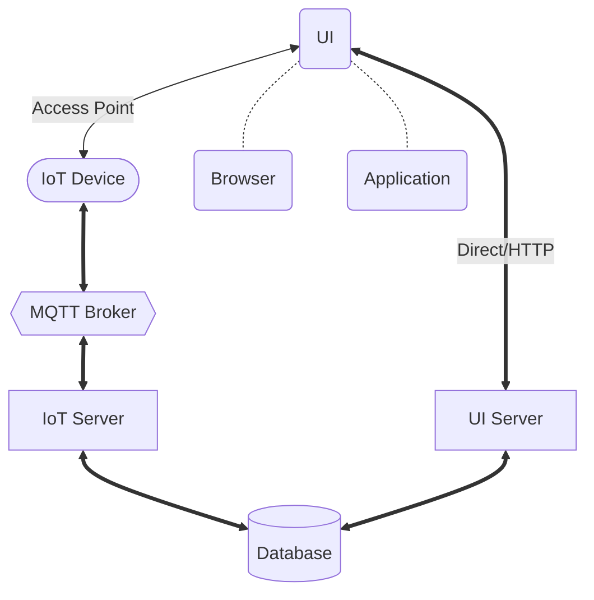

```mermaid
flowchart TD
    %% ===== Nodes =====
    device@{ shape: stadium, label: "IoT Device" }
    broker@{ shape: hexagon, label: "MQTT Broker" }
    iotserver@{ shape: rectangle, label: "IoT Server" }

    db@{ shape: database, label: "Database" }

    ui@{ shape: rounded, label: "UI" }
    uiserver@{ shape: rectangle, label: "UI Server" }

    browser@{ shape: rounded, label: "Browser" }
    app@{ shape: rounded, label: "Application" }

    %% ===== Connections =====
    device <==> broker
    broker <==> iotserver
    iotserver <==> db

    ui <== Direct/HTTP ==> uiserver
    uiserver <==> db

    ui <-- Access Point --> device

    ui <-.- browser
    ui <-.- app
```