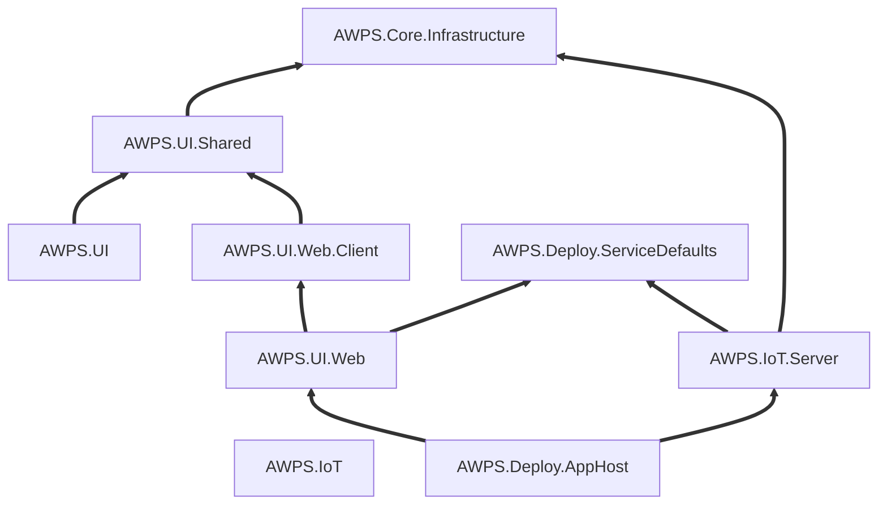

```mermaid
flowchart BT
    %% ===== Nodes =====
    awpsiot@{ shape: rectangle, label: "AWPS.IoT" }
    iotserver@{ shape: rectangle, label: "AWPS.IoT.Server" }

    shared@{ shape: rectangle, label: "AWPS.UI.Shared" }
    webclient@{ shape: rectangle, label: "AWPS.UI.Web.Client" }
    web@{ shape: rectangle, label: "AWPS.UI.Web" }
    ui@{ shape: rectangle, label: "AWPS.UI" }

    infra@{ shape: rectangle, label: "AWPS.Core.Infrastructure" }

    apphost@{ shape: rectangle, label: "AWPS.Deploy.AppHost" }
    servicedefaults@{ shape: rectangle, label: "AWPS.Deploy.ServiceDefaults" }

    %% ===== Connections =====
    ui ==> shared

    webclient ==> shared 
    web ==> webclient 

    shared ==> infra 
    iotserver ==> infra 

    web ==> servicedefaults
    iotserver ==> servicedefaults 

    apphost ==> web
    apphost ==> iotserver
```