# 📘 Auto-Watering Plant System

> *Система для моніторингу та автоматичного поливу рослин*

---

## 👤 Автор

- **ПІБ**: Цап Ілля
- **Група**: ФЕІ-41
- **Керівник**: Хвищун Іван, доцент, викладач кафедри радіофізики та комп'ютерних технологій
- **Дата виконання**: 25.05.2026

---

## 📌 Загальна інформація

- **Тип проєкту**: Вебсайт/Крос-платформний додаток/IoT
- **Мова програмування**: C#
- **Фреймворки / Бібліотеки**: ASP.NET Core, Entity Framework Core, Blazor, MAUI, Aspire, nanoFramework

---

## 🧠 Опис функціоналу

- Веб та крос-платформний додаток
- Реєстрація та авторизація користувачів
- Створення, редагування, видалення профілів IoT-пристроїв
- Перегляд даних з сенсорів в реальному часі
- Конфігурація IoT-пристроїв через GUI
- Збереження даних у базу даних SQL
- Періодичне зібрання даних з сенсорів
- Активація поливу на основі даних з сенсорів
- Можливість тимчасової роботи без інтернету (IoT-пристроїв та GUI)
- Можливість простого Deploy на хмару (Azure, AWS)

---

## 🧱 Опис проєктів

| Проєкт    | Призначення |
|----------------|-------------|
| `Core.Infrastructure` | Містить DbContext та entities, а також MessagePack converters |
| `Deploy.AppHost`    | Запускає повністю рішення. |
| `Deploy.ServiceDefaults` | Додає сервіси, необхідні для dashboard в 'Deploy.AppHost' |
| `IoT` | Імплементація логіки IoT-пристрою |
| `IoT.Server` | Веб-сервер, який обслуговує IoT-пристрої |
| `UI` | Запускає UI на пристрої та імплементує сервіси для Blazor |
| `UI.Shared` | Містить весь UI |
| `UI.Web` | Запускає UI на сервері та імплементує сервіси для Blazor. Додатково надає endpoints для 'UI' та 'UI.Web.Client' проєктів |
| `UI.Web.Client` | Дозволяє 'UI.Web' використовувати компоненти, які працюють прямо в браузері клієнта (Offline підтримка) та імплементує сервіси для Blazor |

---

## ▶️ Як запустити проєкт "з нуля"

### 1. Встановлення інструментів

- Встановити Visual Studio 2026
- Під час встановлення вибрати ".NET Desktop Development", ".NET Multi-platform App UI development", "ASP.NET and web development"
- Встановити .NET 10 SDK, якщо автоматично не встановиться разом з Visual Studio
- Встановити NanoFramework розширення для Visual Studio
- Виконати в терміналі 'dotnet tool install -g nanoff'
- Виконати в терміналі 'dotnet tool install -g dotnet-ef'
- Виконати в терміналі 'winget install Microsoft.Azd'
- Клонувати репозиторій у Visual Studio: https://github.com/itsex0tissle/AWPS

### 2. Створення credentials

- Вибрати MQTT-брокера (можна будь-якого) (використовувався HiveMQ) та створити там сервер
- Створити файл "IoT/MqttInteraction/MqttResources.resx" (шаблон для nanoFramework!)
- Записати там (UserName = string, Password = string, ServerUrl = string, ServerCertificate = textfile(.crt)) MQTT-брокера
- Правою мишою клікнути по файлу та вибрати 'Run custom tool'
- Створити файл "IoT.Server/Resources/MqttResources.resx"
- Записати там (UserName = string, Password = string, ServerUrl = string, ServerCertificate = bytefile(.crt)) MQTT-брокера
- Правою мишою клікнути по файлу та вибрати 'Run custom tool'

### 3. Запустити IoT-пристрій

- Зібрати IoT-пристрій
- 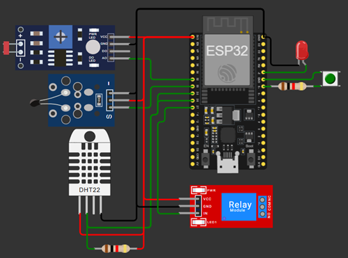
- Підключити IoT-пристрій до комп'ютера
- Встановити драйвера для пристрою, якщо потрібно (https://www.silabs.com/software-and-tools/usb-to-uart-bridge-vcp-drivers)
- Виконати в терміналі 'nanoff --platform esp32 --serialport COM3 --update' (замінивши COM3 на відповідний порт)
- Вибрати 'IoT' проєкт як стартовий і запустити його (CTRL + F5)
- Пізніше натиснути кнопку 'reset', коли буде сказано нижче

### 4. Запустити рішення (локально)

- В терміналі перейти в папку проєкту 'Core.Infrastructure' та виконати 'dotnet ef database update'
- Вибрати 'Deploy.AppHost' проєкт як стартовий і запустити його (CTRL + F5)
- Можливо буде потрібно перезапустити сервери, якщо з'єднання із базою даних не буде встановлено
- Вибрати 'UI' проєкт як стартовий і запустити його (CTRL + F5) (необов'язково)

### 5. Запустити рішення (хмара)

- Перейти в папку рішення в терміналі
- Виконати 'azd auth login' для логіну в Azure
- Виконати 'azd init' в терміналі в корені проєкту (провал також допускається)
- Виконати 'azd provision' для створення ресурсів в Azure
- Перейти в Azure Portal і створити базу даних SQL, а також отримати рядок підключення до неї
- Рядок підключення потрібно записати в 'Core.Infrastructure/Data/ApplicationDbContext.cs'
- В терміналі перейти в папку проєкту 'Core.Infrastructure' та виконати 'dotnet ef database update'
- Перейти в папку рішення та виконати 'azd up' для деплою рішення в Azure
- Після деплою перейти за посиланням на dashboard
- Взяти із dashboard URL для 'UI.Web' проєкту та записати його в 'UI/Helpers/HttpClientHelper.cs', а також 'UI/Program.cs'
- Вибрати 'UI' проєкт як стартовий і запустити його (CTRL + F5) (необов'язково)

---

## 🖱️ Інструкція використання

1. Зареєструвати/увійти в акаунт
2. Створити новий профіль
3. Натиснути кнопку "Configure Device"
4. Натиснути кнопку 'reset' на IoT-пристрої
5. Якщо світлодіод горить (не мигає), потрібно натиснути відведену кнопку на IoT-пристрої
6. Підключити пристрій до точки доступу IoT-пристрою
7. Налаштувати Wi-Fi та прив'язати профіль до IoT-пристрою
8. Відключитись від точки доступу IoT-пристрою та підключитись до мережі
9. Повернутись назад на сторінку профілю 
10. Натиснути відведену кнопку на IoT-пристрої (або почекати 1хв)
11. Почекати до появи кнопки 'Update' над графіком
12. Натиснути кнопку 'Update'
13. Можна робити будь-що

---

## Screenshots

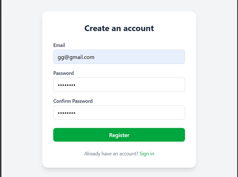  
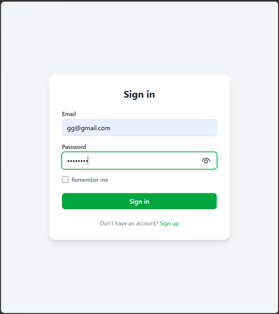   
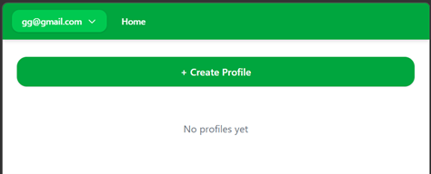   
  
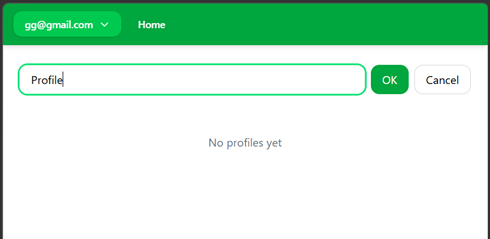  
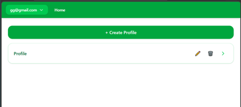  
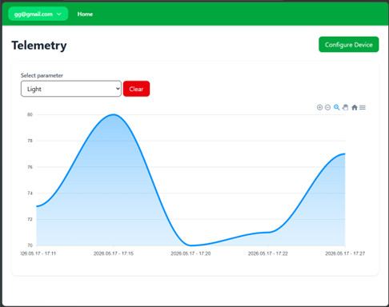  
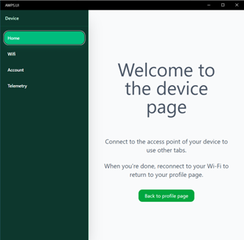  
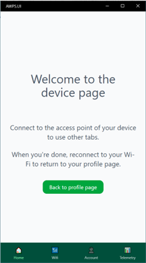  
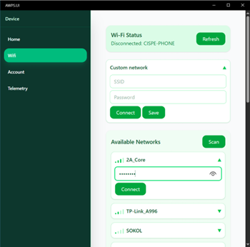  
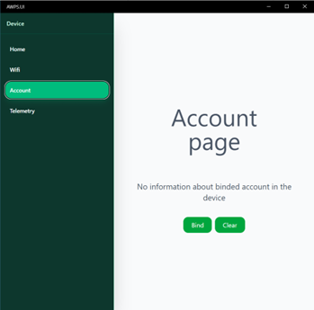  
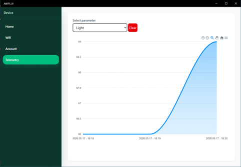  